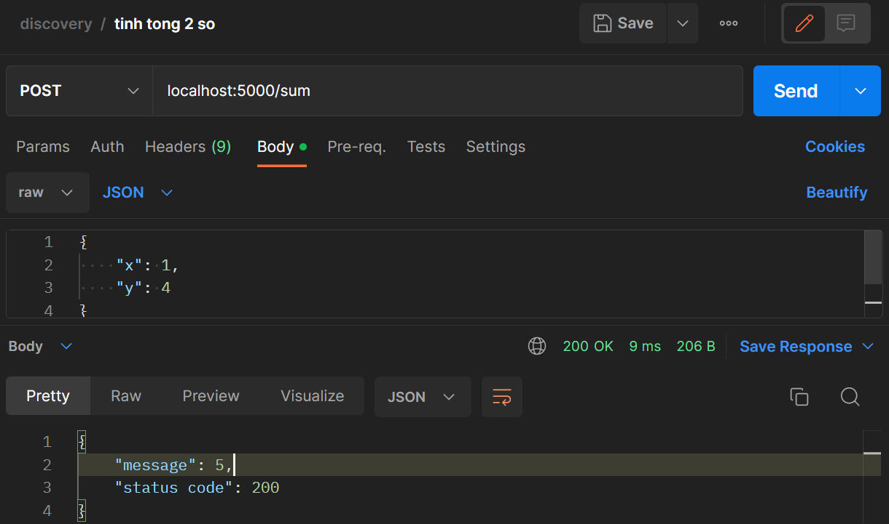

### Requirement

```py
pip install -r requirements.txt
```

### Run

```py
flask run
```

### Api Swagger

* [localhost:5000/swagger](http://localhost:5000/swagger)

### Example

* Homepage: [localhost:5000](http://localhost:5000)
* Service Tinh tong 2 so x va y:
  * Use command: `curl -X POST http://localhost:5000/sum -H 'Content-Type: application/json' -d '{"x": 1,"y": 2}'`
  * Use postman:
>>
